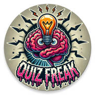

# QuizFreaks

## Description
This application is a quiz bowl/scholastic bowl style trivia game that puts your knowledge to the test. You can play Single Player or go head to head against a friend in Two Player mode to test your quiz bowl skills.
## Contributors
- **Brandon Fischer** - [GitHub Profile](https://github.com/Fischdog24)
- **Jason Engelbrecht** - [GitHub Profile](https://github.com/HashJasonHasher)
- **Raymond Harmon** - [GitHub Profile](https://github.com/raymndh93)
- **Ricardo Reyes** - [GitHub Profile](https://github.com/zodingzode)

## Installation and Running Instructions

### Prerequisites
- **Software Dependencies**: [Android Studio 2024.2.1](https://developer.android.com/studio?gad_source=1&gclid=CjwKCAiA0rW6BhAcEiwAQH28InJ4UeNH9JlpE4vAdedqyPDDtROIxL-SANyk6NMsKIYH1RHhBgR6JBoCa34QAvD_BwE&gclsrc=aw.ds)  
- **Note**: Android Studio will install the latest version of JDK
- **Internet Access**: This application does not require Internet Access

### Setup
Clone the repository inside of Android Studio using the following steps:
1. Copy this HTTPS link taken from inside the project repository: https://github.com/UTSA-CS-3443/QuizFreaks.git
2. If an Android Studio project is already opened, go to the top left bars, select file, and select close Project
3. Inside the Welcome to Android Studio window, Select <strong><u>Get from VCS</u></strong>
4. Paste the URL from Step 1 into the URL box. Do not change the pre-selected directory
5. In the bottom right, hit the <strong><u>Clone</u></strong> button
6. Let the application load inside Android studio. There will be a loading bar in the bottom right of Android Studio
7. Once the application has completed loading, press the green play button in the middle of the screen at the top
8. Wait for the application to load, once loaded the application will launch and you are free to use the app

### Inside the App

#### Selecting 1 Player
1. After selecting the 1 Player mode, you will be brought to a setup screen
2. You have six topics to choose from, you can select as many (all six topics) or as little (a single topic) as you want
3. You have three difficulties to choose from, you can select as many (all three difficulties) or as little (a single difficulty) as you want
4. There will be a **Enter name here** text box below, enter your name inside this text box. This will be used to keep track of your score as you progress through the game and update the leaderboard if you achieve a high score
5. When you are ready to play, press begin. If you want to return home, select the home icon
6. Inside the quiz screen, you have a timer in the top left letting you know how much time is left to solve the question, once the time is up the game will proceed to the next question and no points will be awarded
7. If you want to answer the question, select the answer button. A input box will appear where you can type in your answer. Press enter once you have inputted your answer, if correct the question will disappear and a text displaying **Correct Answer** will pop up, points will be awarded to you, and the quiz will move to the next question. If the answer if incorrect a toast message will pop up letting you know the answer is incorrect and to try again
8. If you don't know the answer, press the next button. This will bring you to the next question and will reset the timer
9. After all the questions in the question pool have been answered, you will be greeted with a **Game Over** screen
10. On the **Game Over** screen, press the finish button to return home

#### Selecting 2 Player
1. After selecting the 2 Player mode, you will be brought to a setup screen
2. You have six topics to choose from, you can select as many (all six topics) or as little (a single topic) as you want
3. You have three difficulties to choose from, you can select as many (all three difficulties) or as little (a single difficulty) as you want
4. There will be two text boxes below named **Player 1 name** and **Player 2 name**, enter each player's name in the respected text box. This will be used to keep track of both player's scores as you progress through the game and update the leaderboard if one of the two players achieves a high score
5. When you are ready to play, press begin. If you want to return home, select the home icon
6. Inside the quiz screen, you have a timer in the top middle letting you know how much time is left to solve the question, once the time is up the game will proceed to the next question and no points will be awarded for either player
7. If a player want to answer the question, select the Player 1 or 2 button depending on which player is ready to answer. A input box will appear where you can type in your answer. Press enter once you have inputted your answer, if correct the question will disappear and a text displaying **Correct Answer** will pop up, the points will be awarded to the player who got the question right, and the quiz will move to the next question. If the answer if incorrect a toast message will pop up letting you know the answer is incorrect and to try again
8. If neither player don't know the answer, press the next button. This will bring you to the next question and will reset the timer
9. After all the questions in the question pool have been answered, you will be greeted with a **Game Over** screen
10. On the **Game Over** screen, press the finish button to return home

#### Selecting Leaderboard
1. After selecting the Leaderboard, a screen will pop up displaying the current leaderboard standings
2. The leaderboard is ranked by points achieved within a quiz 
3. You can scroll through the leaderboard to see where you or your friends rank among each other 

#### Selecting Credits
1. After selecting the Credits, a screen will pop up with the names of the project contributors

#### Selecting Settings
1. After selecting the Settings, a screen will pop up with 2 check boxes, one for music and one for sound effects
2. To turn off the music, un-check the music checkbox, this will turn off the music throughout the app (refer to known issues for further information)
3. To turn off the sound effects, un-check the sound effects checkbox, this will turn off the sound effects throughout the app (refer to known issues for further information)

#### Selecting Game Rules
1. After selecting the Game Rules, a screen will pop up explaining the rules of how the game is supposed to be played

## Known Issues

### Bugs
- **CSV Parser**: The CSV parser implementation skips both the header and the first question instead of just the header
- **Music Player**: If you turn off the music check-box inside the settings it will turn off, but, it will turn back on when returning to the home screen after a quiz is complete
- **Sound effects**: Currently there is not a working implementation to turn off the sound effects when the check box becomes un-checked

### Potential Future Implementations
- **Randomization of Questions**: Currently our app does not randomize the order of the questions, but this is a feature that could be added
- **Online Mulitplayer**: Currently our app does not support anything online, this could be a additional feature to add internet access in the future
- **Dark mode**: Dark mode was going to be a feature but was decided against using due to the complications of time constraits and effort to implement, will be considered for future implementation though

